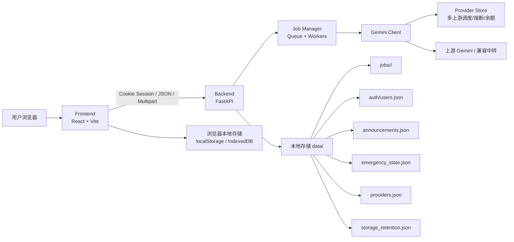
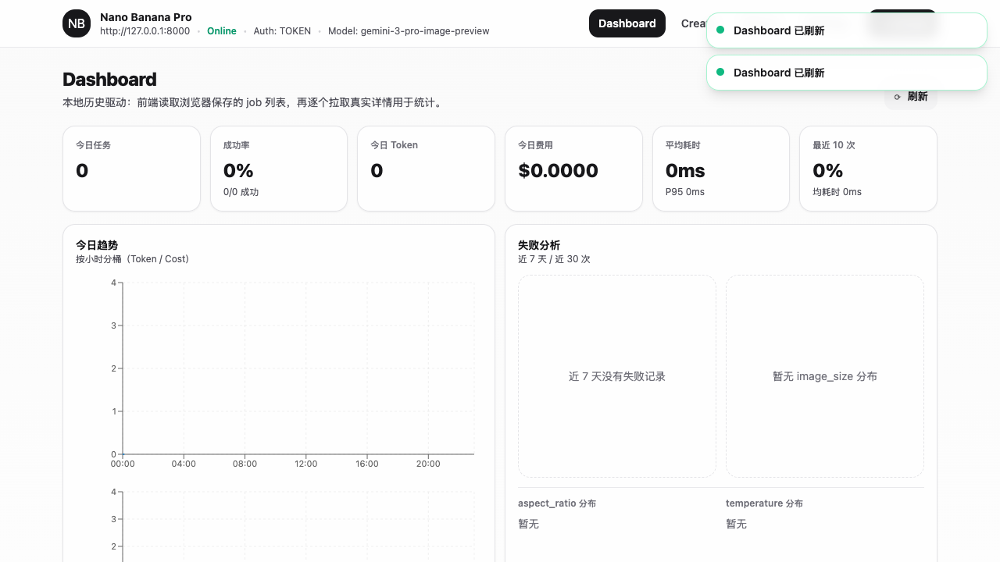
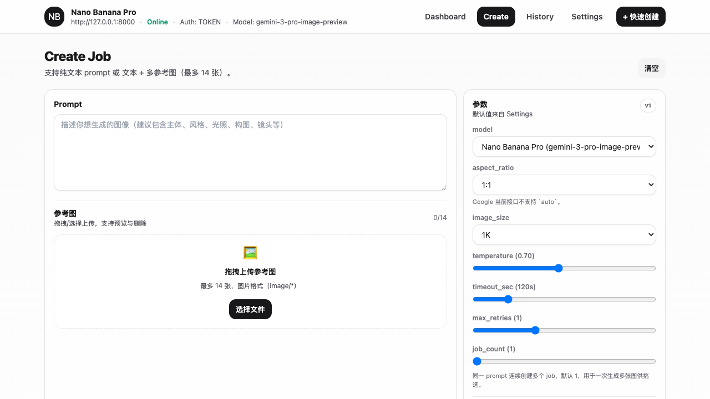
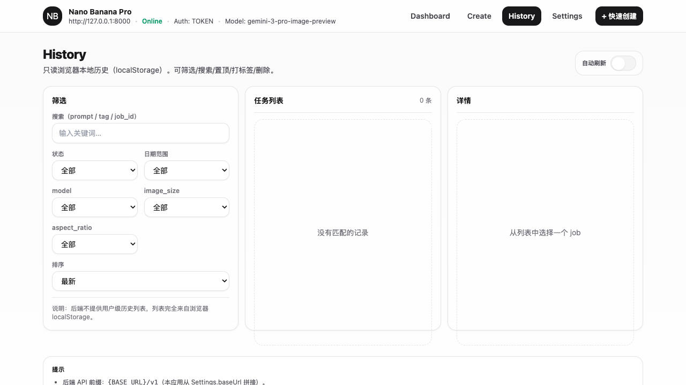
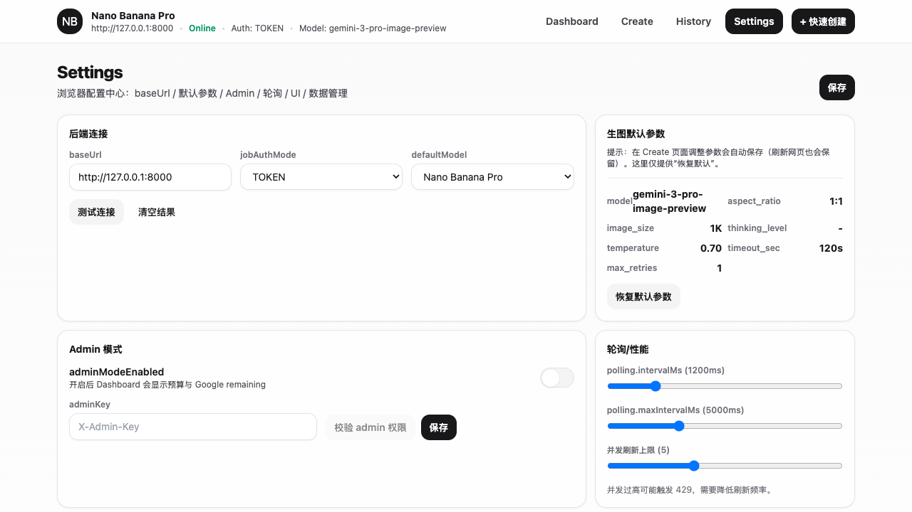
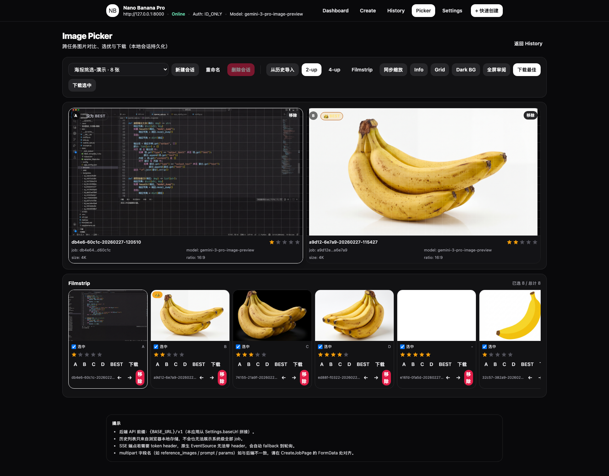

# Nano Banana Pro

一个面向 **图像生成、批量生产、结果挑选、权限控制与运维管理** 的完整 Web 应用。

当前仓库并不只是“调用 Gemini 生成图片”的简单 Demo，而是一套已经具备以下能力的完整系统：

- **FastAPI 后端**：负责鉴权、任务排队、模型参数校验、上游 provider 调度、结果落盘、计费估算、SSE 状态流与管理接口。
- **React + Vite 前端**：负责登录、单任务创建、批量生成、历史检索、图片挑选（Picker）、系统设置与管理员控制台。
- **本地数据持久化**：任务元数据、原图、预览图、请求/响应、日志、用户、公告、provider 状态、存储保留策略全部可落盘。
- **多环境工作流**：同时支持本地 worktree 开发、CI 全量检查、GitHub Release 发版、Docker 镜像分发、服务器 Compose 部署与 Watchtower 自动更新。

> 这份 README 基于当前仓库代码结构、接口实现、脚本和配置文件整理，目标是让你在 **读懂项目、运行项目、二次开发项目、部署项目** 四个层面都能直接上手。

---

## 目录

- [1. 项目概览](#1-项目概览)
- [2. 核心能力](#2-核心能力)
- [3. 架构总览](#3-架构总览)
- [4. 技术栈](#4-技术栈)
- [5. 项目目录结构](#5-项目目录结构)
- [6. 界面预览](#6-界面预览)
- [7. 运行方式总览](#7-运行方式总览)
- [8. 推荐开发方式：worktree 脚本](#8-推荐开发方式worktree-脚本)
- [9. 手工本地开发方式](#9-手工本地开发方式)
- [10. 配置说明](#10-配置说明)
- [11. Provider 机制说明](#11-provider-机制说明)
- [12. 后端 API 概览](#12-后端-api-概览)
- [13. 前端页面与功能说明](#13-前端页面与功能说明)
- [14. 数据存储与目录落盘](#14-数据存储与目录落盘)
- [15. 安全、风控与权限模型](#15-安全风控与权限模型)
- [16. 测试与质量保障](#16-测试与质量保障)
- [17. Docker、CI 与正式发布](#17-dockerci-与正式发布)
- [18. 生产部署说明](#18-生产部署说明)
- [19. 二次开发建议](#19-二次开发建议)
- [20. 常见问题](#20-常见问题)

---

## 1. 项目概览

### 1.1 项目定位

Nano Banana Pro 是一个围绕“**图片生成任务**”设计的全栈系统，核心目标不是单次生成，而是把完整的使用链路做全：

1. 用户登录系统。
2. 选择模型与参数，提交单任务或批量任务。
3. 后端异步排队执行生成。
4. 前端轮询 / SSE 获取任务状态。
5. 图片结果、预览图、输入引用图、请求响应与日志全部可追踪。
6. 用户在历史页和 Picker 中继续筛选、对比、归档与沉淀结果。
7. 管理员可以查看用户、任务、provider、公告、紧急开关、存储保留策略等系统级信息。

### 1.2 这个仓库适合什么场景

它尤其适合以下类型的项目或二次开发场景：

- 想做一个 **可运营** 的图像生成站点，而不是一个只会调 API 的最小样例。
- 想要 **用户体系 + 配额限制 + 后台管理** 的内部平台。
- 想做 **批量生成 / 选图工作流**。
- 想做 **多上游 provider 调度、成本控制、故障熔断**。
- 想要一套同时覆盖 **开发、测试、发版、部署、回滚** 的工程化骨架。

---

## 2. 核心能力

### 2.1 任务生成能力

- 支持 **纯文本生成图**。
- 支持 **文本 + 多张参考图** 的生成请求。
- 支持 **JSON** 与 **multipart/form-data** 两种创建任务方式。
- 默认单任务最多返回 **1 张结果图**（由 `MAX_IMAGES_PER_JOB` 控制，当前默认值为 1）。
- 支持任务 **取消**、**重试**、**状态查询**、**请求体回看**、**响应体回看**。
- 支持通过 **SSE** 订阅任务状态流。
- 支持批量读取任务元信息与批量读取预览图，便于前端做 Dashboard、History、Picker。

### 2.2 模型能力管理

当前后端内置 3 个模型规格：

- `gemini-3.1-flash-image-preview` → Nano Banana 2
- `gemini-2.5-flash-image` → Nano Banana
- `gemini-3-pro-image-preview` → Nano Banana Pro

系统会根据模型能力自动校验或归一化以下参数：

- `mode`
- `aspect_ratio`
- `image_size`
- `thinking_level`
- `temperature`
- `timeout_sec`
- `max_retries`

也就是说，这不是“前端随便传、后端盲收”的接口，而是一个带 **模型能力约束** 的任务系统。

### 2.3 用户与权限能力

- Cookie Session 登录态。
- 自动创建 bootstrap 管理员。
- 用户角色区分：`ADMIN` / `USER`。
- 默认除 `/v1/health` 与 `/v1/auth/login` 外，绝大部分接口都要求已登录。
- Job 资源支持 `job_id + X-Job-Token` 级别访问控制（默认 `JOB_AUTH_MODE=TOKEN`）。
- 管理员具备用户管理、provider 管理、系统策略管理、公告管理、紧急开关管理权限。

### 2.4 风控与配额能力

系统内置了较完整的额度与风控体系：

- 每日生成额度
- 并发任务额度
- 图片访问额度
- Turnstile 二次验证阈值
- 超额后的受控处理逻辑
- 读接口限流（默认每分钟 60 次）
- 紧急开关（暂停生成 / 暂停图片访问 / 锁定普通成员后端访问 / 禁止普通成员新登录）

### 2.5 运维与可观测能力

- 每个任务单独落盘：请求、响应、meta、结果图、预览图、输入图、日志。
- 后端重启时，会把中断中的任务恢复为失败态，避免“永远卡在 RUNNING”。
- 内置存储概览与保留策略。
- 支持手动预估清理空间与自动清理历史任务。
- 支持 provider 健康状态、余额、冷却、熔断、最近调用情况观察。

### 2.6 前端工作流能力

前端不是简单表单，而是完整的使用工作台：

- Dashboard 数据看板
- 单任务 Create 页面
- Batch 批量生成页面
- History 历史检索与任务详情页
- Picker 多图对比/精选页面
- Settings 本地配置中心
- Admin 管理控制台

---

## 3. 架构总览



### 3.1 后端职责

后端主要承担以下职责：

- 登录态与 Session 管理
- Create Job 请求解析与校验
- 模型参数与 provider 权限校验
- 任务排队、执行与重试
- 任务结果与元信息持久化
- 费用估算与使用统计
- 管理接口与控制面接口

### 3.2 前端职责

前端主要承担以下职责：

- 登录与用户会话展示
- 参数配置与任务发起
- 本地历史缓存
- 任务轮询与状态刷新
- 批量流程组织
- 图像挑选与比较
- 管理员控制台交互

### 3.3 数据流特点

本项目的数据流有两个很明显的特点：

1. **后端是真正的权威数据源**：任务状态、图片、用户、provider、配额都以服务端为准。
2. **前端是 local-first 的增强层**：会在浏览器侧缓存设置、作业索引、挑选会话和部分图片数据，以提高交互效率。

---

## 4. 技术栈

### 4.1 后端

- Python 3.11
- FastAPI
- Uvicorn
- Pydantic v2
- httpx
- Pillow
- itsdangerous

### 4.2 前端

- React 18
- TypeScript
- Vite 5
- Tailwind CSS
- React Router
- Zustand
- Framer Motion
- Recharts

### 4.3 测试与工程化

- Pytest
- Vitest
- Testing Library
- Playwright
- ESLint
- Ruff
- GitHub Actions
- Docker / Docker Compose
- Watchtower

---

## 5. 项目目录结构

```text
stable_nanobananapro/
├─ backend/                         # FastAPI 后端
│  ├─ app/
│  │  ├─ main.py                    # API 入口
│  │  ├─ job_manager.py             # 任务队列与 worker 执行器
│  │  ├─ gemini_client.py           # 上游调用封装
│  │  ├─ model_catalog.py           # 模型能力定义
│  │  ├─ storage.py                 # 本地落盘读写
│  │  ├─ user_store.py              # 用户与配额策略
│  │  ├─ provider_store.py          # provider 配置、余额、熔断、状态
│  │  ├─ announcement_store.py      # 公告管理
│  │  ├─ emergency_state_store.py   # 紧急开关状态
│  │  ├─ storage_retention.py       # 存储保留策略与自动清理
│  │  ├─ billing.py                 # 费用估算
│  │  ├─ turnstile.py               # Turnstile 校验
│  │  ├─ security.py                # job/image id 与 token 校验
│  │  └─ schemas.py                 # 请求/响应模型
│  ├─ tests/
│  ├─ .env.example
│  ├─ Dockerfile
│  └─ requirements*.txt
├─ frontend/                        # React + Vite 前端
│  ├─ src/
│  │  ├─ App.tsx                    # 主应用（当前集中式单文件 UI 主体）
│  │  ├─ main.tsx
│  │  └─ logger.ts
│  ├─ public/runtime-config.js      # 运行时前端配置注入
│  ├─ screenshots/                  # README / 展示截图
│  ├─ scripts/                      # 录屏、截图、压力脚本
│  ├─ .env.example
│  ├─ Dockerfile
│  └─ nginx.conf
├─ tools/playwright/                # E2E 与浏览器自动化测试
├─ scripts/                         # worktree、CI、本地仿真、发版辅助脚本
├─ srv_server/                      # 服务器部署模板（Compose + env）
├─ BACKEND_API_DOC.md               # 后端开放 API 文档
├─ AGENTS.md                        # Agent / 维护者接管指南
├─ README.md
└─ nano_banana_pro_frontend_single_file_react_tailwind_ts.jsx
                                   # 前端单文件原型/参考实现
```

### 5.1 你应该优先关注的文件

如果你是第一次接手本项目，建议按以下顺序阅读：

1. `README.md`
2. `AGENTS.md`
3. `backend/app/main.py`
4. `backend/app/job_manager.py`
5. `backend/app/model_catalog.py`
6. `backend/app/provider_store.py`
7. `frontend/src/App.tsx`
8. `BACKEND_API_DOC.md`
9. `scripts/worktree-dev.sh`
10. `srv_server/README.md`

---

## 6. 界面预览

### Dashboard



### Create



### History



### Settings



### Picker



你也可以继续查看这些补充截图：

- `frontend/screenshots/model-switch/`
- `frontend/screenshots/picker/`

---

## 7. 运行方式总览

当前仓库支持两套明确分离的运行方式：

### 方式 A：worktree 开发流程（推荐）

适合：

- 日常开发
- 并行 worktree 开发
- Agent/Codex 环境
- 本地测试与联调

唯一入口：

```bash
./scripts/worktree-dev.sh
```

### 方式 B：本地“生产仿真” / 服务器部署流程

适合：

- 验证 Docker 镜像
- 验证 Compose 部署
- 演练生产机更新与回滚
- 维护服务器部署模板

核心目录：

```text
srv_server/
```

> 默认原则：**开发时优先走 worktree 脚本；Docker/Compose 主要用于本地仿真和服务器部署。**

---

## 8. 推荐开发方式：worktree 脚本

### 8.1 前置要求

建议你的本地环境至少具备：

- Python 3.11
- Node.js 20
- npm
- git
- lsof

### 8.2 初始化

```bash
./scripts/worktree-dev.sh bootstrap
```

这个命令会为当前 worktree 自动建立稳定入口，包括：

- `backend/.venv`
- `backend/.env`
- `backend/data`
- `frontend/.env`
- `frontend/node_modules`
- `tools/playwright/node_modules`
- Playwright 浏览器与运行时目录

同时脚本还会维护一组实例级环境变量：

- `NBP_INSTANCE_ID`
- `NBP_BACKEND_PORT`
- `NBP_FRONTEND_PORT`
- `NBP_BACKEND_URL`
- `NBP_FRONTEND_URL`
- `NBP_BACKEND_DATA_DIR`

### 8.3 启动服务

```bash
./scripts/worktree-dev.sh up backend
./scripts/worktree-dev.sh up frontend
./scripts/worktree-dev.sh up all
```

### 8.4 查看状态与注入环境变量

```bash
./scripts/worktree-dev.sh status
eval "$(./scripts/worktree-dev.sh shellenv)"
```

### 8.5 停止服务

```bash
./scripts/worktree-dev.sh down
```

### 8.6 端口规则

脚本会为每个实例分配 slot，默认端口规则为：

- `backend = 18000 + slot * 10`
- `frontend = 18001 + slot * 10`

这样可以支持多个 worktree 并行开发，避免互相抢端口。

### 8.7 推荐日常开发命令顺序

```bash
./scripts/worktree-dev.sh bootstrap
./scripts/worktree-dev.sh up all
./scripts/worktree-dev.sh test backend
./scripts/worktree-dev.sh test e2e
./scripts/worktree-dev.sh down
```

---

## 9. 手工本地开发方式

如果你不想使用 `worktree-dev.sh`，也可以手工启动前后端。

### 9.1 启动后端

```bash
cd backend
python -m venv .venv
source .venv/bin/activate
pip install -r requirements.dev.txt
cp .env.example .env
python -m uvicorn app.main:app --host 127.0.0.1 --port 8000 --reload
```

后端默认地址：

```text
http://127.0.0.1:8000
```

Swagger：

```text
http://127.0.0.1:8000/docs
```

### 9.2 启动前端

```bash
cd frontend
npm ci
cp .env.example .env
npm run dev -- --host 127.0.0.1 --port 5173
```

前端默认地址：

```text
http://127.0.0.1:5173
```

### 9.3 首次登录

后端启动时会基于下面两个变量自动创建管理员（如果当前没有管理员）：

- `BOOTSTRAP_ADMIN_USERNAME`
- `BOOTSTRAP_ADMIN_PASSWORD`

默认示例值为：

```dotenv
BOOTSTRAP_ADMIN_USERNAME=admin
BOOTSTRAP_ADMIN_PASSWORD=admin123456
```

> 生产环境请务必修改。

---

## 10. 配置说明

本项目配置主要分为：

- 后端 `.env`
- 前端 `.env`
- 生产部署时的 `srv_server/compose/.env`
- 生产部署时的 `srv_server/config/backend.env`

### 10.1 后端核心配置

下面这些配置最重要：

#### 基础与运行时

```dotenv
GEMINI_API_KEY=
GEMINI_API_BASE_URL=https://generativelanguage.googleapis.com/v1beta
GEMINI_HTTP_PROXY=
DEFAULT_MODEL=gemini-3-pro-image-preview
DATA_DIR=./data
JOB_WORKERS=2
JOB_QUEUE_MAX=100
JOB_AUTH_MODE=TOKEN
```

#### 任务与输出限制

```dotenv
MAX_IMAGES_PER_JOB=1
MAX_REFERENCE_IMAGES=14
JOB_TIMEOUT_SEC_DEFAULT=120
JOB_TIMEOUT_SEC_MIN=15
JOB_TIMEOUT_SEC_MAX=600
JOB_WATCHDOG_TIMEOUT_SEC=900
JOB_TTL_DAYS=30
```

#### Session 与测试辅助

```dotenv
SESSION_SECRET_KEY=change-me-session-secret
SESSION_COOKIE_NAME=nbp_session
SESSION_MAX_AGE_SEC=604800
SESSION_HTTPS_ONLY=false
TEST_ENV_ADMIN_BYPASS=false
TEST_FAKE_GENERATOR=false
TEST_FAKE_GENERATOR_LATENCY_MS=120
```

#### Turnstile

```dotenv
TURNSTILE_SITE_KEY=
TURNSTILE_SECRET_KEY=
GENERATION_TURNSTILE_TTL_SEC=600
```

#### 默认配额策略

```dotenv
DEFAULT_USER_DAILY_IMAGE_LIMIT=100
DEFAULT_USER_EXTRA_DAILY_IMAGE_LIMIT=50
DEFAULT_USER_CONCURRENT_JOBS_LIMIT=2
DEFAULT_ADMIN_CONCURRENT_JOBS_LIMIT=20
DEFAULT_USER_TURNSTILE_JOB_COUNT_THRESHOLD=5
DEFAULT_USER_TURNSTILE_DAILY_USAGE_THRESHOLD=50
DEFAULT_USER_DAILY_IMAGE_ACCESS_LIMIT=200
DEFAULT_USER_IMAGE_ACCESS_TURNSTILE_BONUS_QUOTA=15
DEFAULT_USER_DAILY_IMAGE_ACCESS_HARD_LIMIT=350
OVERQUOTA_REAL_JOB_RUN_PROBABILITY=0.5
```

#### CORS 与日志

```dotenv
CORS_ALLOW_ORIGINS=*
CORS_ALLOW_CREDENTIALS=true
LOG_DIR=./data/logs
LOG_LEVEL=INFO
LOG_RETENTION_DAYS=3
RATE_LIMIT_PER_MINUTE=60
```

### 10.2 前端配置

```dotenv
# 可选：直接指定后端 API 地址
# VITE_API_BASE_URL=http://127.0.0.1:8000

VITE_TURNSTILE_SITE_KEY=
VITE_LOG_LEVEL=INFO
VITE_LOG_RETENTION_DAYS=3
VITE_LOG_MAX_ENTRIES=1200
```

### 10.3 推荐的本地最小配置

如果你只是想快速本地联调，通常只需要确认以下几项：

- 后端：
  - `SESSION_SECRET_KEY`
  - `BOOTSTRAP_ADMIN_USERNAME`
  - `BOOTSTRAP_ADMIN_PASSWORD`
  - `TURNSTILE_SECRET_KEY`（若启用真实 Turnstile）
  - `GEMINI_API_KEY` 或 `UPSTREAM_PROVIDERS_JSON`
- 前端：
  - `VITE_API_BASE_URL`
  - `VITE_TURNSTILE_SITE_KEY`

### 10.4 测试模式开关

本项目为自动化测试预留了两个很有用的开关：

#### `TEST_ENV_ADMIN_BYPASS`

开启后：

- 可绕过正常登录流程，直接以管理员身份访问。
- 适合本地自动化测试与 CI。
- 不适合生产环境。

#### `TEST_FAKE_GENERATOR`

开启后：

- 不访问真实上游生成服务。
- 后端会返回受控的假图/假耗时结果。
- 适合端到端测试与 CI 验证。

---

## 11. Provider 机制说明

本项目支持通过 `UPSTREAM_PROVIDERS_JSON` 配置多个上游 provider，而不是把请求死绑到单一 API Key。

### 11.1 设计目标

provider 机制主要为了解决这些问题：

- 多中转站接入
- 上游成本差异
- 不同 provider 支持模型不同
- 余额不足时自动识别
- 连续失败时自动冷却 / 熔断
- 控制最大并发
- 管理员可在后台查看健康度与余额

### 11.2 provider 配置示例

```json
[
  {
    "provider_id": "provider_a",
    "label": "Provider A",
    "adapter_type": "gemini_v1beta",
    "base_url": "https://example.com/v1beta",
    "api_key": "your-api-key",
    "cost_per_image_cny": 0.35,
    "initial_balance_cny": 100,
    "enabled": true,
    "note": "主线路",
    "supported_models": [
      "gemini-3-pro-image-preview",
      "gemini-2.5-flash-image",
      "gemini-3.1-flash-image-preview"
    ],
    "max_concurrency": 2
  }
]
```

### 11.3 行为特征

provider 运行时会维护这些状态：

- 是否启用
- 剩余余额
- 最近成功/失败时间
- 连续失败次数
- 熔断冷却到期时间
- 最近调用记录
- 总花费 / 总生成张数
- 当前活跃请求数

### 11.4 管理员与普通用户的区别

- 普通用户默认不能指定 `provider_id`。
- 管理员可以在任务参数中显式指定 provider。
- 管理员可以在后台修改 provider 启停、备注、余额。

---

## 12. 后端 API 概览

完整 API 说明请同时参考：

- [`BACKEND_API_DOC.md`](./BACKEND_API_DOC.md)
- FastAPI Swagger：`/docs`
- OpenAPI：`/openapi.json`

这里给出与仓库实现最贴近的高层概览。

### 12.1 基础信息

- API 前缀：`/v1`
- 健康检查：`GET /v1/health`
- 模型能力：`GET /v1/models`

### 12.2 鉴权相关接口

- `POST /v1/auth/login`
- `POST /v1/auth/logout`
- `GET /v1/auth/me`
- `PATCH /v1/auth/password`
- `POST /v1/auth/turnstile/generation`
- `POST /v1/auth/turnstile/image-access`

### 12.3 任务相关接口

- `POST /v1/jobs`
- `GET /v1/jobs/{job_id}`
- `GET /v1/jobs/{job_id}/request`
- `GET /v1/jobs/{job_id}/response`
- `GET /v1/jobs/{job_id}/images/{image_id}`
- `GET /v1/jobs/{job_id}/images/{image_id}/preview`
- `GET /v1/jobs/{job_id}/references/{ref_path}`
- `GET /v1/jobs/{job_id}/events`
- `POST /v1/jobs/{job_id}/retry`
- `POST /v1/jobs/{job_id}/cancel`
- `DELETE /v1/jobs/{job_id}`
- `POST /v1/jobs/batch-meta`
- `POST /v1/jobs/active`
- `POST /v1/jobs/previews/batch`
- `POST /v1/dashboard/summary`

### 12.4 公告相关接口

- `GET /v1/announcements/active`
- `POST /v1/announcements/{announcement_id}/dismiss`

### 12.5 管理后台接口

- `GET /v1/admin/overview`
- `GET/PATCH /v1/admin/emergency`
- `GET /v1/admin/storage/overview`
- `POST /v1/admin/storage/cleanup/preview`
- `POST /v1/admin/storage/cleanup/execute`
- `PATCH /v1/admin/storage/retention`
- `GET/POST/PATCH/DELETE /v1/admin/announcements...`
- `GET /v1/admin/users`
- `GET /v1/admin/users/{user_id}/jobs`
- `POST /v1/admin/users`
- `PATCH /v1/admin/users/{user_id}`
- `POST /v1/admin/users/{user_id}/reset-quota`
- `PATCH /v1/admin/policy`
- `GET /v1/admin/providers`
- `PATCH /v1/admin/providers/{provider_id}`
- `POST /v1/admin/providers/{provider_id}/balance/set`
- `POST /v1/admin/providers/{provider_id}/balance/add`

### 12.6 任务创建请求说明

`POST /v1/jobs` 支持两种请求格式：

#### JSON 方式

```json
{
  "prompt": "A cinematic portrait of a girl under neon rain",
  "model": "gemini-3-pro-image-preview",
  "mode": "IMAGE_ONLY",
  "params": {
    "aspect_ratio": "1:1",
    "image_size": "1K",
    "thinking_level": null,
    "provider_id": null,
    "temperature": 0.7,
    "timeout_sec": 120,
    "max_retries": 1
  },
  "reference_images": [
    {
      "mime": "image/png",
      "data_base64": "..."
    }
  ]
}
```

#### Multipart 方式

字段可包括：

- `prompt`
- `model`
- `mode`
- `params`（JSON 字符串）
- 或单独传入：
  - `aspect_ratio`
  - `image_size`
  - `thinking_level`
  - `provider_id`
  - `temperature`
  - `timeout_sec`
  - `max_retries`
- `reference_images`（多文件）

### 12.7 任务状态机

后端当前状态集合：

- `QUEUED`
- `RUNNING`
- `CANCELLED`
- `SUCCEEDED`
- `FAILED`
- `DELETED`

### 12.8 Job 访问控制

当 `JOB_AUTH_MODE=TOKEN` 时：

- 创建任务会返回 `job_access_token`
- 读取 job 元信息、图像、预览图、SSE 等资源时，需带 `X-Job-Token`
- 这样可以在“已登录”的基础上继续收紧单个任务的可见性

### 12.9 计费与估算

后端会为任务保存：

- token usage
- estimated cost
- breakdown
- pricing version / notes

这些信息会体现在任务 `meta` 中，也会影响 Dashboard 和管理视图。

---

## 13. 前端页面与功能说明

### 13.1 Dashboard

作用：

- 查看今日任务数、成功率、Token、费用、耗时等 KPI
- 查看趋势图与失败分布
- 汇总本地 job 索引并回拉服务端详情

适合：

- 日常观察使用情况
- 发现失败率异常
- 快速判断模型/参数使用习惯

### 13.2 Create

作用：

- 创建单个生成任务
- 切换模型、比例、尺寸、温度、超时、重试次数
- 上传参考图
- 按模型能力自动适配参数面板

适合：

- 单次实验
- 提示词调优
- 快速迭代

### 13.3 Batch

作用：

- 基于全局配置 + 分 section 配置做批量生成
- 支持批次命名、备注、页码注入、会话归集策略
- 可把批量结果自动归档到 Picker 会话中

适合：

- 批量出图
- 多段提示词生产
- 一次性生成大量候选图

### 13.4 History

作用：

- 检索本地保存的任务记录
- 按时间、状态、模型、批次名、是否有图等维度过滤
- 展示任务详情、错误信息、图像入口

适合：

- 复盘历史任务
- 找回旧图
- 分析失败案例

### 13.5 Picker

作用：

- 把不同任务的输出图导入到“挑图会话”中
- 支持单图、双图、四图比较模式
- 支持 filmstrip / preferred / deleted 等桶位管理
- 支持评分、精选、沉浸式查看、快捷键交互
- 适合从大量候选图中逐步收敛到最终结果

这是本项目相对有辨识度的一个功能模块，不只是“看图”，而是为 **筛选和决策** 服务。

### 13.6 Settings

作用：

- 管理后端地址、默认模型、默认参数
- 管理轮询频率、缓存大小、主题与动效
- 管理 Picker 调度器参数
- 管理本地数据清理与密码修改

### 13.7 Admin

作用：

- 查看全局概览
- 管理用户与用户策略
- 查看指定用户任务
- 管理 provider 启停、备注、余额
- 配置公告
- 执行紧急封控
- 查看存储占用与执行清理

> Admin 页面是一个真正的控制台，不只是“显示几个统计数字”。

---

## 14. 数据存储与目录落盘

### 14.1 data 目录下会保存什么

后端默认数据目录为：

```text
backend/data/
```

生产环境通常通过 volume 挂载到持久化目录，例如 `/app/data`。

### 14.2 单个任务的落盘结构

每个 job 都会有独立目录：

```text
data/
└─ jobs/
   └─ <job_id>/
      ├─ meta.json
      ├─ request.json
      ├─ response.json
      ├─ input/
      │  └─ reference_0.png
      ├─ result/
      │  └─ image_0.png
      ├─ preview/
      │  └─ image_0.webp
      └─ logs/
         └─ job.log
```

### 14.3 非任务数据

此外还有这些核心文件：

```text
data/
├─ auth/
│  └─ users.json
├─ announcements.json
├─ emergency_state.json
├─ providers.json
├─ storage_retention.json
└─ logs/
```

### 14.4 为什么这种落盘方式有价值

它的优势非常明确：

- 容易排查单个任务
- 容易做审计
- 容易做人工回看与导出
- 容易后续替换为对象存储 / 数据库时做迁移
- 很适合中小规模站点先快速稳定落地

---

## 15. 安全、风控与权限模型

### 15.1 登录与 Session

- 登录成功后，后端通过 Session Cookie 维持用户状态。
- 若用户被禁用，现有 Session 会失效。
- 管理员与普通用户在权限边界上有明确区分。

### 15.2 Turnstile

系统当前把 Turnstile 用在两个地方：

- 登录前校验
- 超过阈值后，生成或图片访问前的额外校验

这使得系统可以把“高频敏感操作”从完全开放改成按需验证。

### 15.3 Job Token

Job Token 的作用是把访问控制下沉到“任务级”而不是只停留在“用户级”。

适合以下场景：

- 前端只缓存必要的 job 访问凭证
- 避免仅凭 job_id 被读取资源
- 在未来扩展分享链接 / 临时访问机制时更自然

### 15.4 配额策略

用户策略支持这些维度：

- 每日生成额度
- 并发任务上限
- Turnstile 触发阈值
- 每日图片访问额度
- 图片访问硬上限
- 额外 bonus quota

管理员可以在后台调整默认系统策略，也可以为单个用户设置覆盖项。

### 15.5 紧急开关

当前系统支持 4 个紧急开关：

- `pause_generation`：暂停新图片生成
- `block_new_member_login`：阻止普通成员登录
- `lock_member_backend`：锁定普通成员大部分后端访问
- `pause_image_access`：暂停普通成员图片访问

这套设计说明项目已经考虑到真实线上运营中的“非常态处理”。

---

## 16. 测试与质量保障

### 16.1 后端测试

```bash
cd backend
pytest tests -q
```

CI 中还会执行：

```bash
ruff check app tests
pytest tests --cov=app --cov-report=term-missing --cov-report=xml -q
```

### 16.2 前端测试

```bash
cd frontend
npm run lint
npm run test -- --run
npm run build
```

### 16.3 E2E 测试

仓库内置了 Playwright 工具链：

```bash
./scripts/worktree-dev.sh test e2e
```

也可以直接：

```bash
cd tools/playwright
npm ci
npm run test:e2e
```

### 16.4 Playwright CLI

当你想做浏览器自动化调试时，推荐用本仓库自带脚本：

```bash
./scripts/worktree-dev.sh up all
eval "$(./scripts/worktree-dev.sh shellenv)"
./tools/playwright/scripts/playwright-cli.sh open "$NBP_FRONTEND_URL" --headed
./tools/playwright/scripts/playwright-cli.sh snapshot
```

### 16.5 CI 检查内容

GitHub Actions 当前会执行：

- 后端 lint + test + coverage
- 前端 lint + test + build
- 真实前后端启动后的 Playwright e2e
- backend / frontend Docker build 校验

这意味着项目已经具备一条相对完整的质量门禁链路。

---

## 17. Docker、CI 与正式发布

### 17.1 CI 工作流

仓库内当前包含两个主要工作流：

#### `ci-full.yml`

触发条件：

- Pull Request
- Push 到 `main`
- 手动触发

主要职责：

- 后端 lint + pytest + coverage
- 前端 lint + vitest + build
- e2e 全链路测试
- backend/frontend Docker 镜像构建校验

#### `release-images.yml`

触发条件：

- GitHub Release 发布

主要职责：

- 构建 backend / frontend Docker 镜像
- 推送正式版本 tag
- 同步推送 `latest`

### 17.2 Dockerfile

#### Backend

- 基于 `python:3.11-slim`
- 安装 `requirements.runtime.txt`
- 通过 `uvicorn app.main:app` 启动

#### Frontend

- 构建阶段基于 `node:20-alpine`
- 运行阶段基于 `nginx:1.27-alpine`
- 通过 `runtime-config` 注入前端运行时配置

### 17.3 版本标签约定

当前 README 与脚本约定正式版本名形如：

```text
v<人类版本号>-<短hash>
```

例如：

```text
v0.1.0-a91c0de
```

这个 tag 会同时承担：

- Git 源码锚点
- GitHub Release 记录
- Docker 镜像版本号
- 回滚依据

---

## 18. 生产部署说明

生产部署模板位于：

```text
srv_server/
```

### 18.1 目录结构

```text
srv_server/
├─ compose/
│  ├─ docker-compose.prod.yml
│  └─ .env.example
├─ config/
│  └─ backend.env.example
└─ data/
```

### 18.2 首次部署步骤

```bash
cd /srv/stable
cp compose/.env.example compose/.env
cp config/backend.env.example config/backend.env
```

然后按实际情况填写：

- Docker Hub namespace / app name
- backend / frontend tag
- backend / frontend 端口
- `SESSION_SECRET_KEY`
- `TURNSTILE_SECRET_KEY`
- `TURNSTILE_SITE_KEY`
- `BOOTSTRAP_ADMIN_USERNAME`
- `BOOTSTRAP_ADMIN_PASSWORD`
- `UPSTREAM_PROVIDERS_JSON`
- `DATA_DIR`

### 18.3 启动 Compose

```bash
cd /srv/stable/compose
docker compose -f docker-compose.prod.yml up -d --remove-orphans
docker compose -f docker-compose.prod.yml ps
```

### 18.4 Watchtower 自动更新

Compose 中内置了 `watchtower` 服务，用于追踪前后端镜像更新。

默认策略是：

- 生产环境盯 `latest`
- 发布新 Release 时自动推送新 `latest`
- Watchtower 自动拉取并更新容器

### 18.5 回滚方式

当你需要回滚时，建议直接把：

- `BACKEND_TAG`
- `FRONTEND_TAG`

从 `latest` 改成某个历史正式版本 tag，然后重新执行：

```bash
docker compose -f docker-compose.prod.yml up -d
```

这种方式比“重新覆盖 latest”更可审计、更稳妥。

---

## 19. 二次开发建议

### 19.1 如果你想扩展模型

优先修改：

- `backend/app/model_catalog.py`
- `backend/app/gemini_client.py`
- 前端模型参数适配逻辑（`frontend/src/App.tsx`）

### 19.2 如果你想扩展 provider 调度

优先修改：

- `backend/app/provider_store.py`
- `backend/app/gemini_client.py`

可以继续增加：

- provider 选择策略
- 更细粒度的错误分类
- 动态权重调度
- 实时余额同步

### 19.3 如果你想把本地落盘迁移为对象存储 / 数据库

优先抽象：

- `backend/app/storage.py`
- `backend/app/user_store.py`
- `backend/app/announcement_store.py`
- `backend/app/provider_store.py`
- `backend/app/storage_retention.py`

### 19.4 如果你想拆分前端单文件结构

当前 `frontend/src/App.tsx` 已经承载了大量页面与状态逻辑，后续建议拆为：

- `pages/`
- `components/`
- `features/`
- `stores/`
- `api/`
- `utils/`

这种拆分会明显提升可维护性。

### 19.5 如果你想接入真正的数据库

推荐的优先级是：

1. 用户与策略
2. 公告与紧急开关
3. 任务索引
4. provider 运行状态
5. 存储保留策略与统计

---

## 20. 常见问题

### Q1：为什么我已经登录了，读取某个 job 图片还是 403？

可能原因：

- 当前 `JOB_AUTH_MODE=TOKEN`
- 你没有传 `X-Job-Token`
- 当前用户并非该 job 的拥有者
- 图片访问触发了额外 Turnstile 校验
- 管理员启用了 `pause_image_access`

### Q2：为什么任务一直在排队？

建议检查：

- `JOB_WORKERS` 是否过小
- `JOB_QUEUE_MAX` 是否已满
- 用户并发上限是否触发
- 上游 provider 是否处于冷却 / 熔断状态
- provider 是否余额不足

### Q3：为什么前端能打开，但生成失败？

优先检查：

- `GEMINI_API_KEY` 或 `UPSTREAM_PROVIDERS_JSON`
- `TURNSTILE_SECRET_KEY`
- provider 的 `supported_models`
- 后端日志与单任务 `response.json` / `job.log`

### Q4：为什么管理员后台看不到 provider 数据？

可能是：

- 没配置 `UPSTREAM_PROVIDERS_JSON`
- 也没有设置 `GEMINI_API_KEY`，因此连 legacy provider 都不会生成

### Q5：为什么后端重启后有些任务变成 FAILED？

这是系统的有意设计。后端启动时会把原本停留在 `QUEUED/RUNNING` 的残留任务恢复为失败态，避免任务永远悬挂。

### Q6：这个项目更适合继续往哪个方向演进？

比较自然的演进方向有：

- 拆分前端结构
- 引入数据库 / 对象存储
- 增加更强的审计与报表
- 增加团队空间 / 项目空间概念
- 增加 webhook / 异步通知
- 把 Picker 演进成更完整的评审系统

---

## 补充文档

仓库内还有几份非常值得一起阅读的文档：

- [`BACKEND_API_DOC.md`](./BACKEND_API_DOC.md)：更偏接口实现层面的后端文档
- [`AGENTS.md`](./AGENTS.md)：面向维护者 / Agent 接管的工作约束与开发说明
- [`srv_server/README.md`](./srv_server/README.md)：服务器部署目录说明

---

## 总结

如果用一句话概括这个仓库：

**它是一套面向真实使用场景的图像生成工作台，而不是一个只会调模型接口的最小样例。**

它已经覆盖了：

- 用户登录
- 模型能力约束
- 任务排队执行
- 结果落盘与回看
- 批量生成
- 历史检索
- 图片挑选
- 管理控制面
- 多 provider 调度
- 配额与风控
- CI / Docker / 发版 / 服务器部署

对于继续做产品化或内部平台化，这是一个非常不错的基础骨架。
